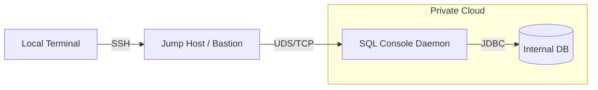

# Sql Console

> A lightweight, multi-purpose SQL terminal designed for modern infrastructure.

Sql Console is a high-performance CLI tool that bridges your local environment with remote databases. It is specifically designed to be **Bastion Host (Jump Host) Ready**, allowing DBAs and Developers to manage internal databases securely and efficiently from a central entry point.

## Why Sql Console?

*   **Bastion Ready**: Lightweight installation, perfect for jump hosts with restricted environments.
*   **Performance**: Built with a Go client and a Java Daemon for maximum JDBC performance.
*   **Connectivity**: Manage multiple database profiles (PostgreSQL, MySQL, etc.) with ease.
*   **Visibility**: Rich terminal UI with pagination, table rendering, and schema browsing.
*   **Automation**: Export large datasets directly to CSV or Excel from the command line.

## Architecture & Use Case

Sql Console uses a **Client-Daemon split** architecture. The Daemon handles JDBC connections and heavy lifting, while the Client provides a fast, responsive CLI experience.

### Jump Host Scenario

In a typical production environment, databases are tucked away in private subnets. Sql Console can be installed on a Jump Host to provide a premium console experience without exposing your database to the public internet.



## Software Requirement

*   **Java 21+**: Required for the Daemon service.
*   **OS**: Linux (Optimized for Debian/Ubuntu).

## How to deploy?

### Windows

1. Install Java 21+ on your Windows environment.
2. Run the standalone installer `sql-console-windows-installer_0.3.0_amd64.exe`:

```cmd
=============================================
    SQL Console Windows Installer v0.3.0
=============================================
Enter installation directory [default: sql-console]: C:\var\sql-console

Installing SQL Console to: C:\var\sql-console
 - Extracted: sql.exe
 - Extracted: README-Windows.txt
 - Extracted: start-daemon.bat
 - Extracted: sql-console-daemon-0.3.0.jar
 - Extracted: sql-daemon-service.exe

Configuring Windows Environment...
 - C:\var\sql-console is already in User PATH
 - Created Start Menu shortcut: SQL Console Daemon

Installation Complete! ??
To get started:
1. [Interactive Mode]: Open Start Menu and click 'SQL Console Daemon' to start the backend service.
2. [Background Service]: To install as an automatic background Windows Service, run as Administrator:
   C:\var\sql-console\sql-daemon-service.exe install && C:\var\sql-console\sql-daemon-service.exe start
3. Open a new Command Prompt or PowerShell and type 'sql -version'.

Press Enter to exit...
```

* Install Service

Enter admin mode, run `sql-daemon-service.exe install`, and then type `sql-daemon-service.exe start`.

```cmd
sql-daemon-service.exe install
```

* Stop Service

```cmd
sql-daemon-service.exe stop
```

* uninstall

Enter admin mode, run `sql-daemon-service.exe uninstall`.

```cmd
sql-daemon-service.exe uninstall
```


### Debian Base


```bash
sudo apt install openjdk-21-jre
sudo apt install ./sql-console_0.3.0_amd64.deb
```

```log
❯ sudo apt install ./release/sql-console_0.3.0_amd64.deb
Note, selecting 'sql-console' instead of './release/sql-console_0.3.0_amd64.deb'

Installing:
  sql-console

Suggested UDDHSSSs:
  openjdk-21-jre

Summary:
  Upgrading: 0, Installing: 1, Removing: 0, Not Upgrading: 0
  Download size: 0 B / 16.6 MB
  Space needed: 0 B / 982 GB available

Get:1 sql-console/release/sql-console_0.3.0_amd64.deb sql-console amd64 0.3.0 [16.6 MB]
Selecting previously unselected UDDHSSS sql-console.
(Reading database ... 355507 files and directories currently installed.)
Preparing to unpack .../sql-console_0.3.0_amd64.deb ...
Unpacking sql-console (0.3.0) ...
Setting up sql-console (0.3.0) ...
Created symlink '/etc/systemd/system/multi-user.target.wants/sql-console-daemon.service' → '/etc/systemd/system/sql-console-daemon.service'.
!!!!!!!!!!!!!!!!!!!!!!!!!!!!!!!!!!!!!!!!!!!!!!!!!!!!!!!!
 WARNING: JRE 21 not detected!
 Current version: /var/lib/dpkg/info/sql-console.postinst: line 23: java: command not found
 Please install openjdk-21-jre for best performance.
 Command: sudo apt install openjdk-21-jre
!!!!!!!!!!!!!!!!!!!!!!!!!!!!!!!!!!!!!!!!!!!!!!!!!!!!!!!!
```

## How to uninstall ?


```bash
sudo apt autoremove --purge sql-console
```

## How to use?

Sql Console provides both a one-shot command mode and an interactive REPL mode.

### 1. Profile Management
Profiles allow you to save connection strings securely.

**Add a connection:**

```bash
❯ sql profile
Usage: sql profile <add|list|delete> [args]
```

```bash
❯ sql profile add testdb jdbc:postgresql://localhost:5432/testdb testdba password
Profile 'testdb' added successfully.
```

**List connections:**

```bash
❯ sql profile list
Profiles:
 - testdb
```

### 2. Connect & Query
You can enter interactive mode or run one-shot commands.

**Enter Interactive REPL:**

```bash
❯ sql -p testdb
sql-console v0.3.0
Connected to: testdb
Type \q to quit, \? for help.

```

**List Tables (\dt):**

```bash
testdb> \dt
sql_id: list-OSUDLs , transaction: auto-commit
┌────────┬─────────────────────────────────────────┬───────┬─────────────────────────────────────────────────────────────────────────────────────────────────────┐
│ SCHEMA │                  NAME                   │ TYPE  │                                               REMARKS                                               │
├────────┼─────────────────────────────────────────┼───────┼─────────────────────────────────────────────────────────────────────────────────────────────────────┤
│ public │ jdieen                                  │ OSUDL │                                                                                                     │
│ public │ test_topsql                             │ OSUDL │ Curabitur aliquet quam id dui posuere                                                               │
│ public │ test_trend_cache_sizes                  │ OSUDL │ Donec elit libero                                                                                   │
│ public │ test_trend_dbtime                       │ OSUDL │ Sed porttitor lectus nibh                                                                           │
│ public │ test_trend__percentages                 │ OSUDL │ Vivamus magna justo                                                                                 │
│ public │ test_trend_load_profile                 │ OSUDL │ Pellentesque in ipsum id orci porta dapibus                                                         │
│ public │ test_trend_load_profile_avg             │ OSUDL │ Vestibulum ante ipsum primis in faucibus orci luctus et ultrices                                    │
│ public │ test_trend_memory_statistics            │ OSUDL │ Quisque velit nisi                                                                                  │
│ public │ test_trend_pct_time_by_wait_class       │ OSUDL │ Cras ultricies ligula sed magna dictum porta                                                        │
│ public │ test_trend_shared_pool                  │ OSUDL │ Mauris blandit aliquet elit                                                                         │
│ public │ mgmt_dba_audit                          │ OSUDL │ Proin eget tortor risus                                                                             │
│ public │ mgmt_OIKKL_usage_snap                   │ OSUDL │ Donec rutrum congue leo eget malesuada                                                              │
│ public │ mgmt_monthly_test                       │ OSUDL │ Praesent sapien massa, convallis a pellentesque nec                                                 │
│ public │ mgmt_obj_inventory                      │ OSUDL │ Nulla quis lorem ut libero malesuada feugiat                                                        │
│ public │ mgmt_user_audit                         │ OSUDL │ Curabitur non nulla sit amet nisl tempus                                                            │
│ public │ stat                                    │ OSUDL │                                                                                                     │
│ public │ ts                                      │ OSUDL │                                                                                                     │
└────────┴─────────────────────────────────────────┴───────┴─────────────────────────────────────────────────────────────────────────────────────────────────────┘
```


**Run a Query:**

```bash
testdb> select * from mgmt_monthly_test where test_month = '0022-01' and category = 'DDMCJENSKS';
sql_id: f10e243e , transaction: auto-commit
result fetch size: 20
page: 1/8, total rows: 149
┌────────┬─────────┬───────────────┬────────────┬──────────────┬────────────┬──────────┬──────────────┬─────────┬─────────┬────────┐
│ USD IU │ ODM KDD │    IDHUDDI    │    OKID    │ test MONTH │  CATEGORY  │  TESTSI  │  ITEM NAME   │ VALUE 1 │ VALUE 2 │ REMARK │
├────────┼─────────┼───────────────┼────────────┼──────────────┼────────────┼──────────┼──────────────┼─────────┼─────────┼────────┤
│ 151    │ 1       │ 7869876987612 │ 0987654513 │ 0022-01      │ DDMCJENSKS │ UDDISS   │ YDIS         │ 40      │ NULL    │ NULL   │
│ 151    │ 1       │ 7869876987612 │ 0987654513 │ 0022-01      │ DDMCJENSKS │ UDDISS   │ LOB          │ 2       │ NULL    │ NULL   │
│ 151    │ 1       │ 7869876987612 │ 0987654513 │ 0022-01      │ DDMCJENSKS │ GDKEOSKD │ FUNCTION     │ 4       │ NULL    │ NULL   │
│ 151    │ 1       │ 7869876987612 │ 0987654513 │ 0022-01      │ DDMCJENSKS │ GDKEOSKD │ LOB          │ 2       │ NULL    │ NULL   │
│ 151    │ 1       │ 7869876987612 │ 0987654513 │ 0022-01      │ DDMCJENSKS │ UDDISS   │ OSUDL        │ 215     │ NULL    │ NULL   │
│ 151    │ 1       │ 7869876987612 │ 0987654513 │ 0022-01      │ DDMCJENSKS │ UDDISS   │ POL          │ 8       │ NULL    │ NULL   │
│ 151    │ 1       │ 7869876987612 │ 0987654513 │ 0022-01      │ DDMCJENSKS │ GDKEOSKD │ PROCEDURE    │ 3       │ NULL    │ NULL   │
│ 151    │ 1       │ 7869876987612 │ 0987654513 │ 0022-01      │ DDMCJENSKS │ KSEXP    │ OOSDJDM      │ 1       │ NULL    │ NULL   │
│ 151    │ 1       │ 7869876987612 │ 0987654513 │ 0022-01      │ DDMCJENSKS │ GDKEOSKD │ OSUDL        │ 2203    │ NULL    │ NULL   │
│ 151    │ 1       │ 7869876987612 │ 0987654513 │ 0022-01      │ DDMCJENSKS │ GDKEOSKD │ YDIS         │ 20      │ NULL    │ NULL   │
│ 151    │ 1       │ 7869876987612 │ 0987654513 │ 0022-01      │ DDMCJENSKS │ GDKEOSKD │ OIKKL        │ 42      │ NULL    │ NULL   │
│ 151    │ 1       │ 7869876987612 │ 0987654513 │ 0022-01      │ DDMCJENSKS │ PSPEIF   │ POL          │ 4       │ NULL    │ NULL   │
│ 151    │ 1       │ 7869876987612 │ 0987654513 │ 0022-01      │ DDMCJENSKS │ UDDISS   │ OIKKL        │ 6       │ NULL    │ NULL   │
│ 151    │ 1       │ 7869876987612 │ 0987654513 │ 0022-01      │ DDMCJENSKS │ GDKEOSKD │ POL          │ 1       │ NULL    │ NULL   │
│ 151    │ 1       │ 7869876987612 │ 0987654513 │ 0022-01      │ DDMCJENSKS │ UDDISSDM │ OOSDJDM      │ 1       │ NULL    │ NULL   │
│ 180    │ 1       │ 1234567876545 │ 123459004  │ 0022-01      │ DDMCJENSKS │ APPLSYS  │ SEQUENCE     │ 3       │ NULL    │ NULL   │
│ 180    │ 1       │ 1234567876545 │ 123459004  │ 0022-01      │ DDMCJENSKS │ GL       │ OSUDL        │ 675     │ NULL    │ NULL   │
│ 180    │ 1       │ 1234567876545 │ 123459004  │ 0022-01      │ DDMCJENSKS │ PSPE     │ UDDHSSS      │ 90      │ NULL    │ NULL   │
│ 180    │ 1       │ 1234567876545 │ 123459004  │ 0022-01      │ DDMCJENSKS │ PSPE     │ CLASS        │ 9       │ NULL    │ NULL   │
│ 180    │ 1       │ 1234567876545 │ 123459004  │ 0022-01      │ DDMCJENSKS │ KSWIP    │ OSUDL        │ 5       │ NULL    │ NULL   │
└────────┴─────────┴───────────────┴────────────┴──────────────┴────────────┴──────────┴──────────────┴─────────┴─────────┴────────┘

(20 rows affected, 27ms)
testdb> 
```

* Switch page

```bash
testdb> \p 2
sql_id: f10e243e , transaction: auto-commit
result fetch size: 20
page: 2/8, total rows: 149
┌────────┬─────────┬───────────────┬───────────┬──────────────┬────────────┬─────────┬───────────────────┬─────────┬─────────┬────────┐
│ USD IU │ ODM KDD │    IDHUDDI    │   OKID    │ test MONTH │  CATEGORY  │  TESTSI │     ITEM NAME     │ VALUE 1 │ VALUE 2 │ REMARK │
├────────┼─────────┼───────────────┼───────────┼──────────────┼────────────┼─────────┼───────────────────┼─────────┼─────────┼────────┤
│ 180    │ 1       │ 1234567876545 │ 123459004 │ 0022-01      │ DDMCJENSKS │ Q1SPC   │ MATERIALIZED YDIS │ 1       │ NULL    │ NULL   │
│ 180    │ 1       │ 1234567876545 │ 123459004 │ 0022-01      │ DDMCJENSKS │ PO      │ YDIS              │ 5       │ NULL    │ NULL   │
│ 180    │ 1       │ 1234567876545 │ 123459004 │ 0022-01      │ DDMCJENSKS │ PSPE    │ TRIGGER           │ 8       │ NULL    │ NULL   │
│ 180    │ 1       │ 1234567876545 │ 123459004 │ 0022-01      │ DDMCJENSKS │ KSWIP   │ OIKKL             │ 4       │ NULL    │ NULL   │
│ 180    │ 1       │ 1234567876545 │ 123459004 │ 0022-01      │ DDMCJENSKS │ TSCST   │ OSUDL             │ 3       │ NULL    │ NULL   │
│ 180    │ 1       │ 1234567876545 │ 123459004 │ 0022-01      │ DDMCJENSKS │ KSCAMEX │ OOSDJDM           │ 1       │ NULL    │ NULL   │
│ 180    │ 1       │ 1234567876545 │ 123459004 │ 0022-01      │ DDMCJENSKS │ GL      │ OIKKL             │ 675     │ NULL    │ NULL   │
│ 180    │ 1       │ 1234567876545 │ 123459004 │ 0022-01      │ DDMCJENSKS │ GG      │ OSUDL             │ 4       │ NULL    │ NULL   │
│ 180    │ 1       │ 1234567876545 │ 123459004 │ 0022-01      │ DDMCJENSKS │ PO      │ OSUDL             │ 5       │ NULL    │ NULL   │
│ 180    │ 1       │ 1234567876545 │ 123459004 │ 0022-01      │ DDMCJENSKS │ PSPE    │ POL               │ 1       │ NULL    │ NULL   │
│ 180    │ 1       │ 1234567876545 │ 123459004 │ 0022-01      │ DDMCJENSKS │ SYSMAN  │ UDDHSSS           │ 1       │ NULL    │ NULL   │
│ 180    │ 1       │ 1234567876545 │ 123459004 │ 0022-01      │ DDMCJENSKS │ SYSMAN  │ UDDHSSS BODY      │ 5       │ NULL    │ NULL   │
│ 180    │ 1       │ 1234567876545 │ 123459004 │ 0022-01      │ DDMCJENSKS │ KSIT    │ OSUDL             │ 32      │ NULL    │ NULL   │
│ 180    │ 1       │ 1234567876545 │ 123459004 │ 0022-01      │ DDMCJENSKS │ PSPE    │ PROCEDURE         │ 10      │ NULL    │ NULL   │
│ 180    │ 1       │ 1234567876545 │ 123459004 │ 0022-01      │ DDMCJENSKS │ PSPE    │ OIKKL             │ 1       │ NULL    │ NULL   │
│ 180    │ 1       │ 1234567876545 │ 123459004 │ 0022-01      │ DDMCJENSKS │ KSCST   │ OIKKL             │ 15      │ NULL    │ NULL   │
│ 180    │ 1       │ 1234567876545 │ 123459004 │ 0022-01      │ DDMCJENSKS │ KSNOTES │ OOSDJDM           │ 1       │ NULL    │ NULL   │
│ 180    │ 1       │ 1234567876545 │ 123459004 │ 0022-01      │ DDMCJENSKS │ ONT     │ OSUDL             │ 5       │ NULL    │ NULL   │
│ 180    │ 1       │ 1234567876545 │ 123459004 │ 0022-01      │ DDMCJENSKS │ PSPE    │ OSUDL PARTITION   │ 1       │ NULL    │ NULL   │
│ 180    │ 1       │ 1234567876545 │ 123459004 │ 0022-01      │ DDMCJENSKS │ KSENG   │ YDIS              │ 3       │ NULL    │ NULL   │
└────────┴─────────┴───────────────┴───────────┴──────────────┴────────────┴─────────┴───────────────────┴─────────┴─────────┴────────┘

(20 rows affected, 0ms)
testdb> 
```

### 3. Exporting Data
Sql Console supports exporting results directly to CSV or Excel files.

```bash
❯ client/sql -p testdb -o test_test.csv "select * from mgmt_monthly_test where test_month = '0022-01' and category = 'DDMCJENSKS'"
Exporting results to: test_test.csv (format: csv)
sql_id: f10e243e , transaction: auto-commit
result fetch size: 149
page: 1/1, total rows: 149

(149 rows affected, 14ms)
```

### 4. Importing Data
Sql Console supports high-performance importing of CSV files directly into your database tables. By utilizing a Go-based client parser and NDJSON streaming via Unix Domain Sockets, the import process achieves extremely low memory usage (OOM protection) even when processing large datasets with hundreds of thousands of rows.

#### Basic Usage

To import a CSV file into a target table, specify the `-import` and `-table` flags. By default, it will use the first available profile if `-p` is omitted.

```bash
❯ sql <profile_name> -import <csv_path> -table <table_name>
```

#### Column Mapping

If the CSV header names do not match the database column names, you can specify a custom column mapping using the `-map` flag:

```bash
❯ sql -p testdb -import TMP/data.csv -table users -map "Username=username,EmailAddress=email"
```

*Format*: `-map "csvHeader1=dbColumn1,csvHeader2=dbColumn2,..."`

#### Special Table Rule (`cns_data_tmp`)

For the standard temporary table `cns_data_tmp`, Sql Console has a built-in default mapping if `-map` is omitted:
* `國家代碼` -> `country_code`
* `地方代碼` -> `location_code`
* `國家名稱` -> `country_name`
* `地方名稱` -> `location_name`
* `備註` -> `remarks`

**Example:**
```bash
❯ sql -p testdb -import TMP/CNS-13189_2017.csv -table cns_data_tmp
```
#### How it Works

1. **Client Parsing**: The Go client reads the CSV file in batches, handles BOM (Byte Order Mark), applies headers mapping, and serializes the data into NDJSON.
2. **IPC Streaming**: NDJSON payloads are streamed over UDS (Unix Domain Sockets) in batches of 1,000 rows to the Java Daemon.
3. **Daemon Batch Insert**: The Java Daemon receives the NDJSON stream, parses it into an `ImportRequest` record, and executes JDBC Batch Inserts with detailed exception tracking (captures specific `BatchUpdateException` details for auditing).
4. **Auditing**: All import attempts, row counts, and detailed outcomes are logged into `/var/log/sql-console/audit.log`.

---

### 5. Oracle Database Special Commands

#### Show Parameters

```sql
testdb> show parameter sga_target;
```

Output:

```log
testdb> show parameter sga_target;
sql_id: 8f255f9d , transaction: auto-commit
result fetch size: 20
page: 1/1, total rows: 1
┌────────────┬──────┬────────────┬────────────────────┐
│    NAME    │ TYPE │   VALUE    │    DESCRIPTION     │
├────────────┼──────┼────────────┼────────────────────┤
│ sga_target │ 6    │ 8589934592 │ Target size of SGA │
└────────────┴──────┴────────────┴────────────────────┘

(1 rows affected, 24ms)
```

#### DescRIBE command

```sql
testdb> desc dual
```

```log
testdb> desc dual
sql_id: 54e09cab , transaction: auto-commit
result fetch size: 20
page: 1/1, total rows: 1
┌───────┬────────┬─────────────┐
│ NAME  │ NULL ? │    TYPE     │
├───────┼────────┼─────────────┤
│ DUMMY │ NULL   │ VARCHAR2(1) │
└───────┴────────┴─────────────┘

(1 rows affected, 226ms)
```


## logs


```log
root@pollo-nb-5310:~# more /var/log/sql-console/audit.log 
2026-05-15 21:41:12 - SERVER_START: Socket Path=/run/sql-console/sql-console.sock
2026-05-15 21:41:30 - CONN_ATTEMPT: OS_User=pollochang, Profile=testdb, DB_User=testdba, Remote=UDS
2026-05-15 21:41:30 - CONN_SUCCESS: OS_User=pollochang, Profile=testdb, DB_User=testdba
2026-05-15 21:41:30 - QUERY_START: OS_User=pollochang, Profile=testdb, DB_User=testdba, SQL=[select * from
 test where test_month = '2026-01' and category = 'DDL_CHANGE']
2026-05-15 21:41:31 - SECURITY_VIOLATION: OS_User=pollochang, Action=QUERY_END, Reason=DB_User=testdba, P
rofile=testdb, Rows=20, Time=39ms
2026-05-15 21:41:48 - CONN_ATTEMPT: OS_User=pollochang, Profile=testdb, DB_User=testdba, Remote=UDS
2026-05-15 21:41:48 - CONN_SUCCESS: OS_User=pollochang, Profile=testdb, DB_User=testdba
2026-05-15 21:41:48 - SECURITY_VIOLATION: OS_User=pollochang, Action=REQUEST_HANDLING, Reason=Action=fetch,
 DB_User=testdba, Profile=testdb
```

## Jump Host Tips

*   **Profile Persistence**: Profiles are stored in `/etc/sql-console/profiles` (system-wide) or `~/.sql-console/profiles` (user-specific). On a jump host, you can set up common profiles for the whole DBA team.
*   **Security**: Always use Unix Domain Sockets (UDS) for communication between the client and daemon to ensure local-only access.
*   **Performance**: If you are exporting millions of rows on a jump host, use the `-o` flag to write directly to a file, which is faster than rendering to the terminal.
